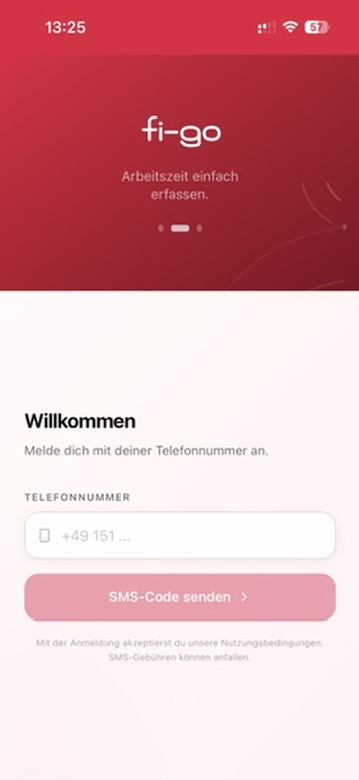
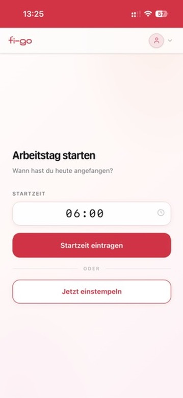
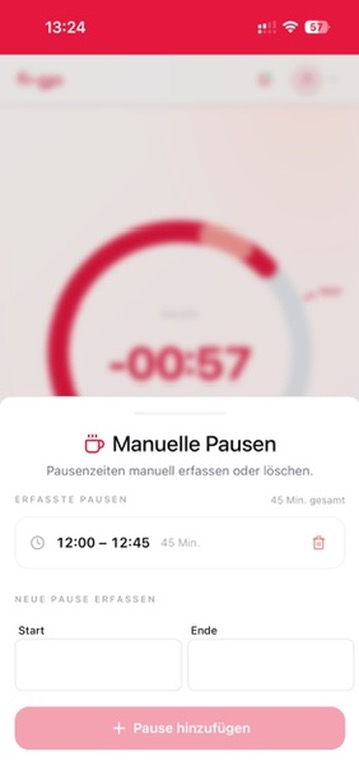
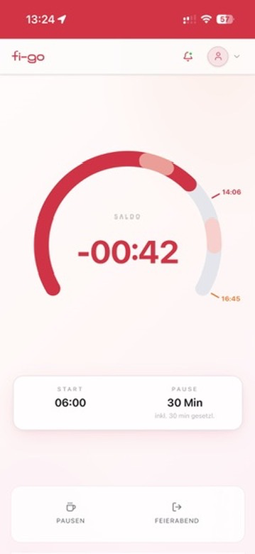
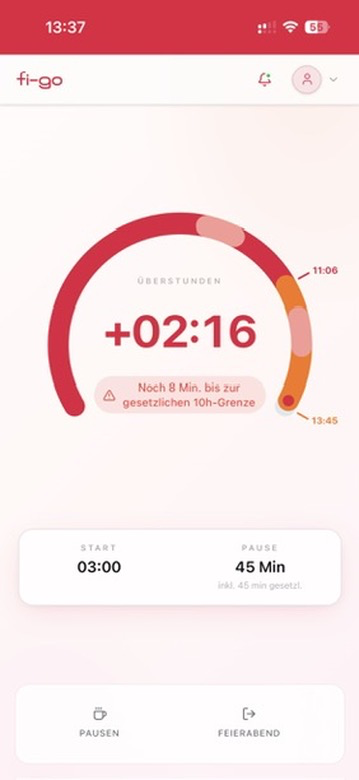
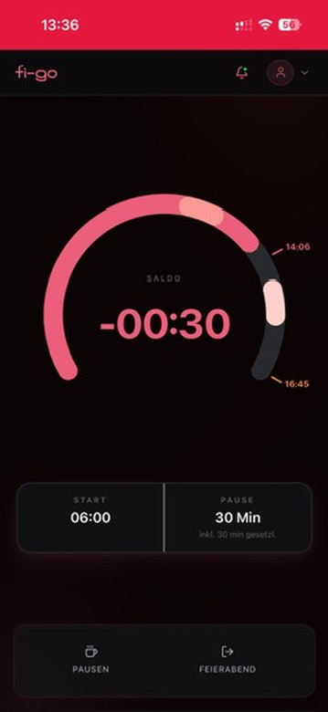
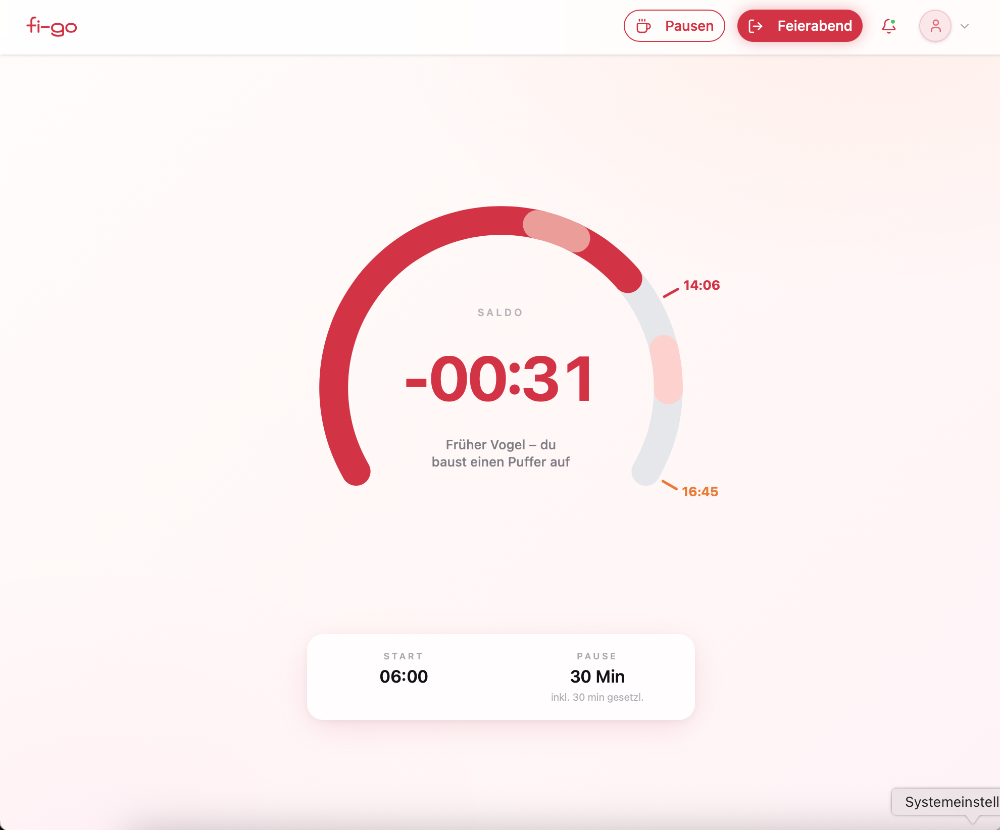

# fi-go

[](https://github.com/MrGoro/fi-go/actions/workflows/deploy-hosting.yml)
[](https://github.com/MrGoro/fi-go/actions/workflows/ci.yml)
[](LICENSE)
[](https://nodejs.org)

**fi-go** ist eine Progressive Web App (PWA) zur Arbeitszeiterfassung – optimiert für den täglichen Gebrauch auf Desktop und Mobilgeräten. Die App berechnet automatisch gesetzliche Pausenzeiten nach deutschem Arbeitszeitgesetz, zeigt den Saldo in Echtzeit an und sendet Push-Benachrichtigungen pünktlich zum Feierabend.

**Live-App:** [fi-go.schuermann.app](https://fi-go.schuermann.app)

---

## Screenshots

<table>
  <tr>
    <td align="center"><br/><sub>Passwordless Login</sub></td>
    <td align="center"><br/><sub>Einstempeln</sub></td>
    <td align="center"><br/><sub>Pausenverwaltung</sub></td>
    <td align="center"><br/><sub>Echtzeit-Timer</sub></td>
    <td align="center"><br/><sub>10-Stunden-Warnung</sub></td>
    <td align="center"><br/><sub>Dark Mode</sub></td>
    <td align="center"><br/><sub>Desktop Ansicht</sub></td>
  </tr>
</table>

---

## Features

- **Passwordless Login** — Anmeldung per Telefonnummer und SMS-OTP über Firebase Auth, kein Passwort erforderlich
- **Echtzeit-Timer** — Visueller Fortschrittsring mit Saldo-Anzeige, aktualisiert sich sekündlich im Browser
- **Gesetzliche Pausen (ArbZG)** — Automatische Berechnung und Anzeige der Pflichtpausen: 30 Min. nach 6 h, 45 Min. nach 9 h Arbeitszeit
- **Manuelle Pausen** — Eigene Pausenzeiten erfassen und nachträglich anpassen
- **Cross-Device-Sync** — Einstempeln am Desktop, Fortschritt am iPhone verfolgen – alles via Firebase Realtime Database in Echtzeit
- **Push-Benachrichtigungen** — Sekundengenaue Reminder bei Feierabend und vor Erreichen der 10-Stunden-Grenze (Desktop, Android, iOS PWA ab 16.4)
- **Installierbar als PWA** — Funktioniert auf iOS, Android und Desktop wie eine native App
- **Auto-Reset** — Alte Sessions vom Vortag werden beim nächsten Login automatisch bereinigt

---

## Architektur

fi-go ist als npm-Workspace-Monorepo organisiert mit drei Packages:

```
fi-go/
├── projects/
│   ├── shared/          @figo/shared – gemeinsame Geschäftslogik (TS)
│   ├── web/             React PWA (Vite 8, Tailwind CSS v4)
│   └── functions/       Firebase Functions v2 (Node.js 22)
├── .github/
│   ├── actions/setup/   Composite Action: Node + Install + Build
│   └── workflows/       CI/CD-Pipelines
├── firebase.json        Firebase-Konfiguration (Hosting, Functions, DB)
└── database.rules.json  Realtime Database Security Rules
```

### Tech Stack

| Bereich | Technologie |
|---|---|
| Frontend | React 18, Vite 8, Tailwind CSS v4, TypeScript 5.7 |
| PWA | vite-plugin-pwa, Custom Service Worker |
| Backend | Firebase Functions v2, Node.js 22 |
| Datenbank | Firebase Realtime Database |
| Auth | Firebase Authentication (Phone/OTP) |
| Push | Firebase Cloud Messaging + Google Cloud Tasks |
| Hosting | Firebase Hosting |
| CI/CD | GitHub Actions + Workload Identity Federation |

### Push-Notification-Architektur

Push-Benachrichtigungen werden sekundengenau ausgeliefert – nicht per Polling, sondern via **Google Cloud Tasks**:

1. Ein Datenbankschreibvorgang auf `/data/{userId}` triggert `onSessionDataWritten`
2. Die Function berechnet die exakten Feierabend- und 10-Stunden-Zeitpunkte
3. Zwei Tasks werden in der Cloud-Tasks-Queue mit dem jeweiligen `scheduleTime` enqueued
4. Zum berechneten Zeitpunkt ruft Cloud Tasks `onSendPushNotification` auf
5. Die Function prüft, ob die Session noch aktuell ist, und sendet FCM-Nachrichten an alle aktiven Geräte
6. Abgemeldete Tokens (>30 Tage inaktiv) werden täglich per Scheduler-Function bereinigt

### Zeitregeln (Standard)

Die Werte sind in `projects/shared/src/constants.ts` konfigurierbar:

| Regel | Wert |
|---|---|
| Soll-Arbeitszeit | 7 Std. 36 Min. |
| Gesetzliche Pause 1 | 30 Min. nach 6 h Arbeitszeit |
| Gesetzliche Pause 2 | 45 Min. nach 9 h Arbeitszeit |
| Gesetzliches Maximum | 10 Stunden |

---

## Lokale Entwicklung

### Voraussetzungen

- [Node.js 22](https://nodejs.org)
- [Firebase CLI](https://firebase.google.com/docs/cli) (`npm install -g firebase-tools`)
- Ein eigenes Firebase-Projekt mit aktivierter **Phone Authentication**, **Realtime Database** und **Cloud Messaging**

### Setup

```bash
# Repository klonen
git clone https://github.com/MrGoro/fi-go.git
cd fi-go

# Abhängigkeiten installieren (alle Workspaces)
npm install

# Umgebungsvariablen anlegen
cp projects/web/.env.example projects/web/.env
# .env mit eigenen Firebase-Werten aus der Firebase Console befüllen
```

### Entwicklungsserver starten

```bash
npm run dev
```

Baut `@figo/shared` und startet anschließend den Vite-Dev-Server für die Web-App.

### Alle verfügbaren Scripts

| Script | Beschreibung |
|---|---|
| `npm run dev` | Dev-Server starten (shared:build + Vite HMR) |
| `npm run build` | Produktionsbuild der Web-App nach `dist/web/` |
| `npm run shared:build` | Shared-Package einmalig kompilieren |
| `npm run functions:build` | Firebase Functions kompilieren |
| `npm run functions:deploy` | Functions manuell deployen |
| `npm run lint` | ESLint für die Web-App ausführen |

---

## Deployment

Das Deployment erfolgt vollautomatisch über GitHub Actions.

| Trigger | Pipeline | Ergebnis |
|---|---|---|
| Push auf `main` (web/shared) | `deploy-hosting.yml` | Deploy auf Firebase Hosting |
| Push auf `main` (functions/shared) | `deploy-functions.yml` | Deploy der Firebase Functions |
| Pull Request öffnen | `preview-hosting.yml` | Firebase Hosting Preview Channel + PR-Kommentar |
| Pull Request schließen | `preview-cleanup.yml` | Preview Channel wird gelöscht |
| Pull Request öffnen | `ci.yml` | Lint + Typecheck für web und functions |

Die Authentifizierung gegenüber Google Cloud erfolgt über **Workload Identity Federation** – es sind keine langlebigen Service-Account-Keys im Repository erforderlich.

### Erforderliche GitHub Secrets

| Secret | Beschreibung |
|---|---|
| `GCP_WIF_PROVIDER` | Workload Identity Provider Resource Name |
| `GCP_WIF_SERVICE_ACCOUNT_HOSTING` | Service Account für Hosting-Deploys |
| `GCP_WIF_SERVICE_ACCOUNT_FUNCTIONS` | Service Account für Functions-Deploys |
| `VITE_FIREBASE_PROJECT_ID` | Firebase Projekt-ID |
| `VITE_FIREBASE_API_KEY` | Firebase API Key |
| `VITE_FIREBASE_AUTH_DOMAIN` | Firebase Auth Domain |
| `VITE_FIREBASE_DATABASE_URL` | Realtime Database URL |
| `VITE_FIREBASE_STORAGE_BUCKET` | Firebase Storage Bucket |
| `VITE_FIREBASE_MESSAGING_SENDER_ID` | FCM Sender ID |
| `VITE_FIREBASE_APP_ID` | Firebase App ID |
| `VITE_FIREBASE_VAPID_KEY` | VAPID Key für Web Push |

---

## Lizenz

MIT — siehe [LICENSE](LICENSE)
