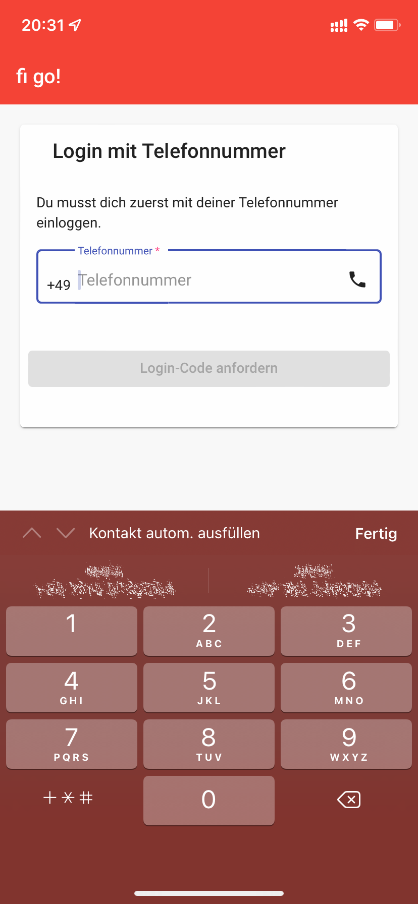
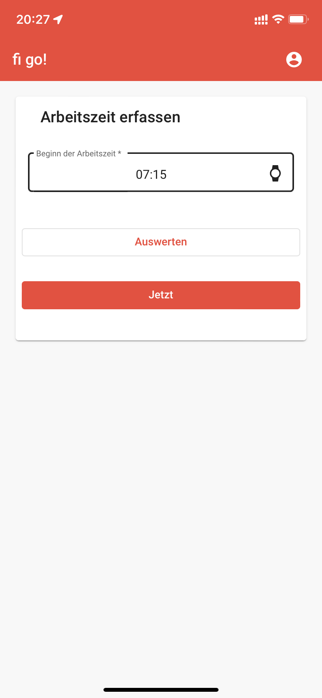
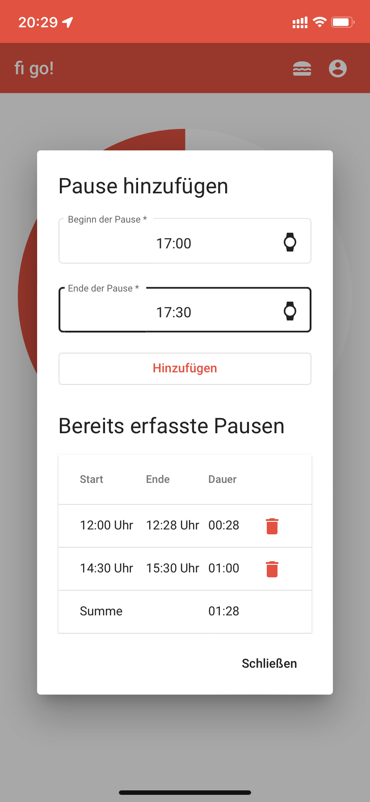
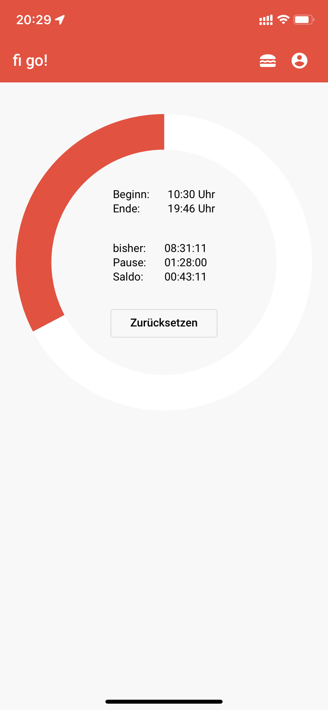
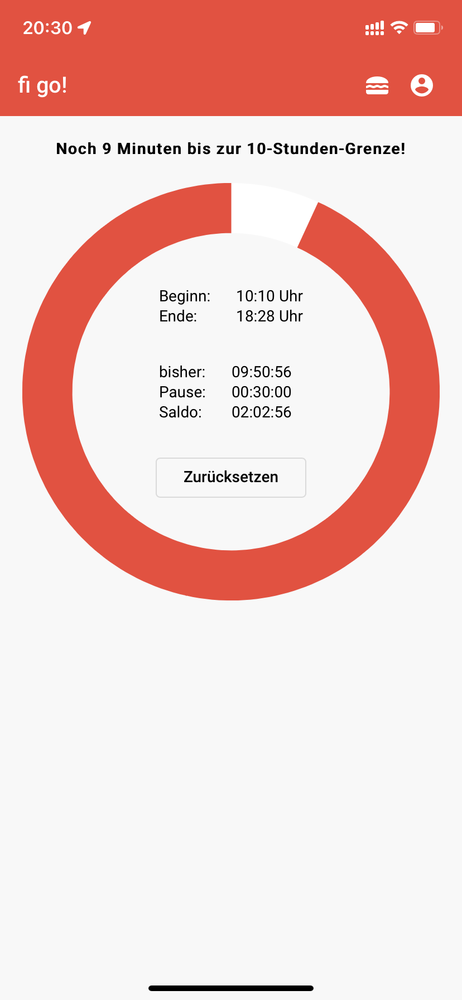

# fi-go!

App: https://fi-go.schuermann.app

Arbeitszeitrechner als Angular-Webapp auf der Firebase-Plattform:
* Login mit Firebase Auth
* Datenspeicherung in Firebase Realtime Database
* Push-Notifications über Firebase Functions & Cloud Messaging
* Hosting der Anwendung über Firebase Hosting

## Features
* Login ohne Passwort per Telefonnummer
* Synchronisation über alle Geräte
* Fortschrittsanzeige
* Push-Notifications kurz vor Ender der Arbeitszeit und vor 
Erreichen der 10-Stunden-Grenze

## Zeiten
Folgende Zeiten sind in der Anwendung konfiguriert:
* Arbeitszeit: 7:48 Stunden
* Pause: 30 Minuten nach Ablauf von 6 Stunden
* Manuelle Pausen können hinzugefügt werden
* Hinweis auf 10-Stunden-Grenze nach 9:30 Stunden
* Warnung, nachdem 10-Stunden-Grenze überschritten ist

## Screenshots

